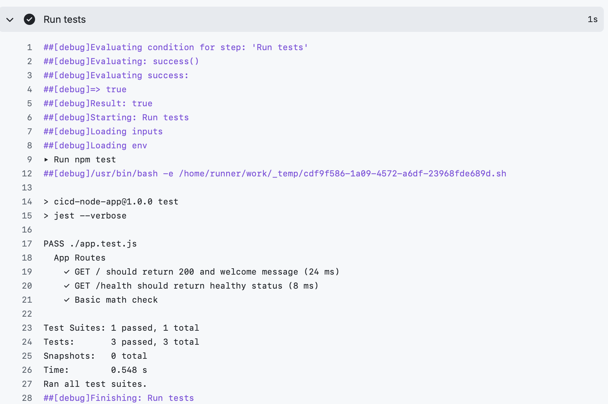
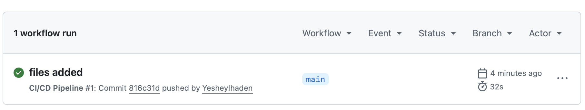
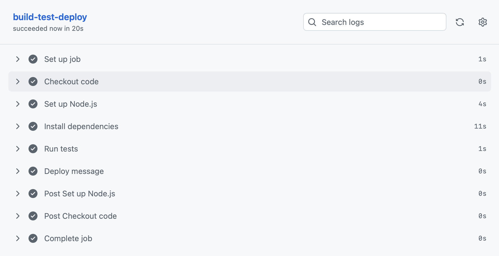
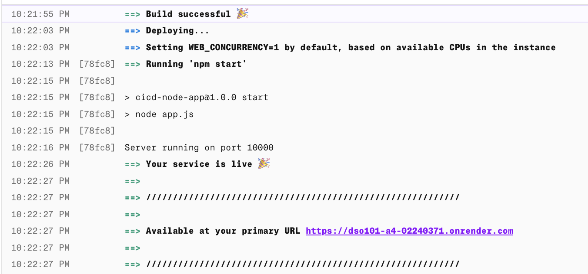
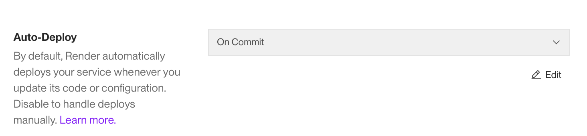

# Assignment 4: CI/CD Pipeline with Testing & Deployment
 
**Course:** DSO101 — DevOps Fundamentals  
**Student:** Yesheylhaden  
**Date:** May 14, 2026  
**GitHub Repository:** https://github.com/Yesheylhaden/DSO101_A4_02240371.git  
**Live Application:** https://dso101-a4-02240371.onrender.com

---
 
## 1. Objective
 
In this assignment, you can see how a full CI/CD pipeline is implemented using widely accepted DevOps tools for building, testing, and deploying a web application on a cloud hosting service written in Node.js.

**Used tools:**
- **GitHub** - versioning and source code management
- **GitHub Actions** - CI/CD pipeline automation tool
- **Node.js + Express** - web application framework
- **Jest + Supertest** - automated unit testing framework
- **Render** - cloud-based automatic deployment platform
---
 
## 2. Project Structure

The project follows the structure specified in the assignment brief:
 
```
cicd-node-app/
├── app.js                        # Express web application
├── app.test.js                   # Jest unit tests
├── package.json                  # Node.js dependencies & scripts
└── .github/
    └── workflows/
        └── ci.yml                # GitHub Actions pipeline
```
 
Every ach file has its role:
- **app.js** – Defines two endpoints: `/` (main page endpoint) and `/health` (health-check endpoint).
- **app.test.js** – Consists of 3 tests for the app, which uses Jest, and consists of 1 basic test and 2 tests of routes.
- **package.json** – Includes dependencies `"express"` and devDependencies `"jest"`, `"supertest"`.
- **ci.yml** – CI/CD pipeline with GitHub Actions triggered on each commit in `main`.

---

### 3. Backend application (Express.js)

This app was implemented using the Node framework named Express.js, exposing two endpoints:
```javascript
const express = require('express');
const app = express();
 
app.get('/', (req, res) => {
  res.send('Hello from CI/CD Pipeline! Node.js app is running.');
});
 
app.get('/health', (req, res) => {
  res.status(200).json({ status: 'healthy', message: 'App is working fine' });
});
 
if (require.main === module) {
  const PORT = process.env.PORT || 3000;
  app.listen(PORT, () => console.log(`Server running on port ${PORT}`));
}
 
module.exports = app;
```
 
> By implementing `module.exports`, it allows us to import the code within our test file without starting the server. This is the suggested way of testing Express applications.

---

## 4. Unit Tests Using Jest

Three unit tests have been created using **Jest** and **Supertest**. Supertest makes HTTP requests to the Express application without starting the server.

```javascript
const request = require('supertest');
const app = require('./app');
 
describe('App Routes', () => {
  test('GET / should return 200 and welcome message', async () => {
    const res = await request(app).get('/');
    expect(res.statusCode).toBe(200);
    expect(res.text).toContain('Hello from CI/CD Pipeline');
  });
 
  test('GET /health should return healthy status', async () => {
    const res = await request(app).get('/health');
    expect(res.statusCode).toBe(200);
    expect(res.body.status).toBe('healthy');
  });
 
  test('Basic math check', () => {
    expect(1 + 1).toBe(2);
  });
});
```
 
### Test Results
 
| Test | Description | Result |
|------|-------------|--------|
| Test 1 | GET / returns 200 and welcome message | ✅ PASSED |
| Test 2 | GET /health returns healthy JSON status | ✅ PASSED |
| Test 3 | Basic math assertion (1+1=2) | ✅ PASSED |
 
**All 3 tests passed in 0.548 seconds.**
 
### Screenshot — Jest Test Output
 

 
---
 
## 5. CI/CD Pipeline (GitHub Actions)
 
The pipeline is defined in `.github/workflows/ci.yml` and triggers automatically on every push to `main`.
 
```yaml
name: CI/CD Pipeline

on:
  push:
    branches: [ "main" ]
  pull_request:
    branches: [ "main" ]
 
jobs:
  build-test-deploy:
    runs-on: ubuntu-latest
 
    steps:
    - name: Checkout code
      uses: actions/checkout@v3
 
    - name: Set up Node.js
      uses: actions/setup-node@v3
      with:
        node-version: "18"
 
    - name: Install dependencies
      run: npm install
 
    - name: Run tests
      run: npm test
 
    - name: Deploy message
      run: echo "✅ Tests passed! Deploying to Render..."
```
 
### Pipeline Steps Summary
 
| Step | Action | Duration |
|------|--------|----------|
| Set up job | Initialize Ubuntu runner | 1s |
| Checkout code | Clone repo from GitHub | 1s |
| Set up Node.js | Install Node.js 18 | 4s |
| Install dependencies | Run `npm install` | 10–11s |
| Run tests | Execute Jest test suite | 1s |
| Deploy message | Echo deploy confirmation | 0s |
| Complete job | Teardown runner | 0s |
 
**Total pipeline duration: 20 seconds. Status: ✅ Succeeded**
 
### Screenshot — GitHub Actions Green Workflow Run
 

 
### Screenshot — All Pipeline Steps Passing
 

 
---
 
## 6. Deployment to Render
 
Deployment to the cloud platform **Render**, which automatically deploys the app on commits in GitHub.
 
### Render Configuration
 
| Setting | Value |
|---------|-------|
| Platform | Render (render.com) |
| Runtime | Node.js |
| Build Command | `npm install` |
| Start Command | `npm start` |
| Auto-Deploy | On Commit |
| Live URL | https://dso101-a4-02240371.onrender.com |
 
### Deployment Log
 
```
10:21:55 PM   ==> Build successful 🎉
10:22:03 PM   ==> Deploying...
10:22:13 PM   ==> Running 'npm start'
10:22:16 PM   Server running on port 10000
10:22:26 PM   ==> Your service is live 🎉
10:22:27 PM   ==> Available at your primary URL
               https://dso101-a4-02240371.onrender.com
```
 
### Screenshot — Render Build & Deploy Logs
 

 
### Screenshot — Live App in Browser
 

 
### Screenshot — Auto-Deploy Setting (On Commit)
 

 
---
 
## Conclusion

This project is a successful realization of a full CI/CD pipeline including all necessary elements:

- Working **Node.js/Express** backend application with 2 RESTful APIs
- Automatic unit testing using **Jest** (3 tests, all passed within less than one second)
- Integration of a **GitHub Actions** job for building, installation, and testing after pushing to the `main` branch
- Deployment of the application **automatically** to **Render cloud server** each time a developer makes commits
- **Working and publicly accessible** web application available through the Render URL
This CI/CD process guarantees that all changes in code will be automatically checked and then uploaded without manual interference.
